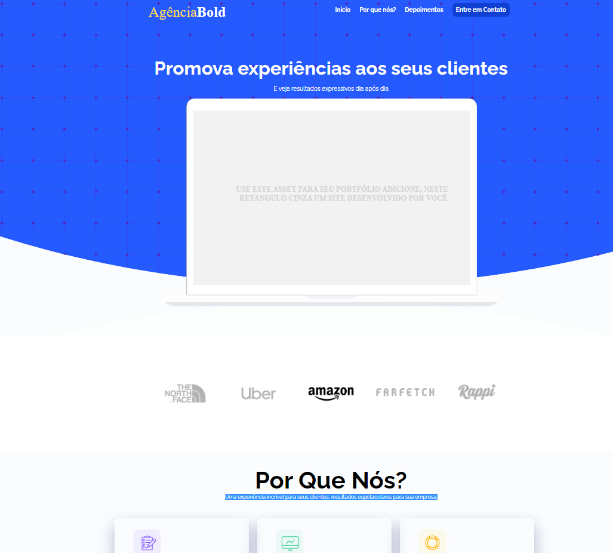

# Agencia Site Portifolio

## Projeto Pagina Web Completa e Responsiva👈 

## Click para ver: <a href='https://joaogabrielz.github.io/AgenciaSitePortifolio'>Deploy</a> 

### Tecnologias usadas: 👈 
 HTML , 
 CSS , 
JQuery , 
JAVASCRIPT , 
 VSCODE
- Projeto Responsivo
